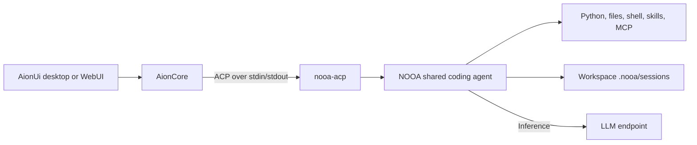
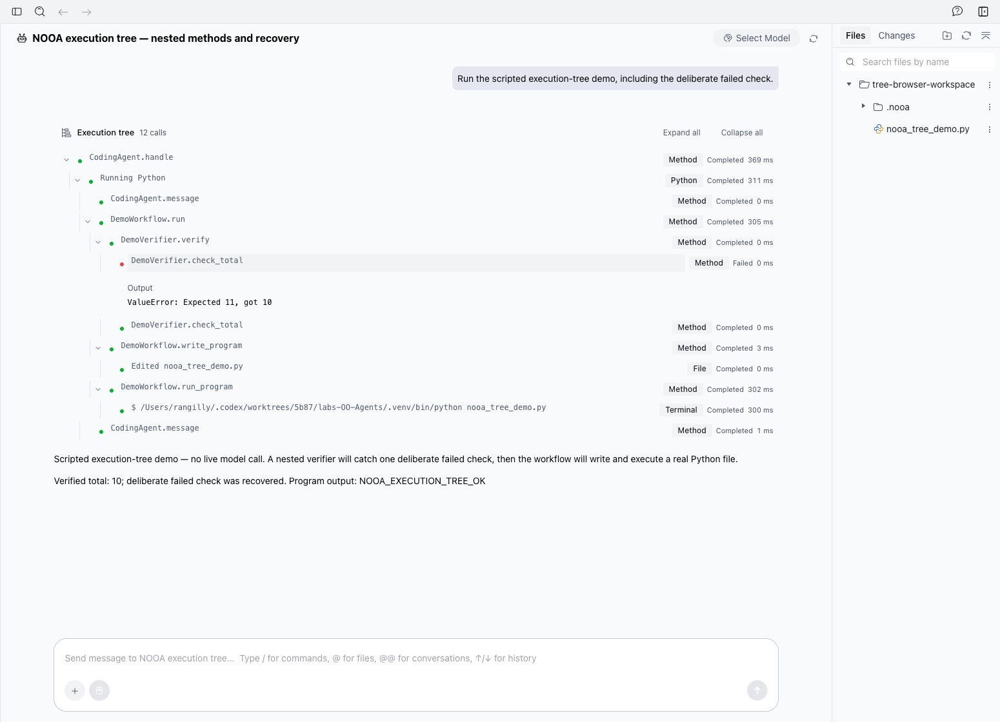
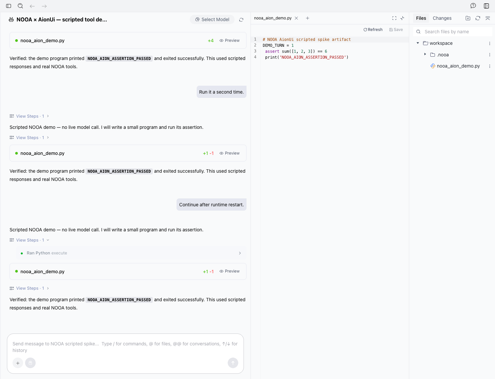

# AionUi on NOOA: integration spike

**Verdict: go for a coding-agent UI.** AionUi can drive the existing NOOA ACP
server without a fork of either application. Real application tests verified
chat, Python/tool output, file diffs, and resuming the same NOOA session after a
runtime restart. The main follow-up work is permission requests, model
selection, and hosting arbitrary domain agents beyond the shared interactive coding-agent contract.

**The live model also worked through AionUi:** a secured, self-hosted Qwen
model wrote a file, executed it, recovered from a Python mistake, and completed
the turn.

## Research question

Can AionUi provide the interactive application around NOOA while NOOA owns
agent execution, tools, context, and durable sessions?

The current target is NOOA's shared `ExperimentalCodingAgent`, the default ACP
agent after #330. `--legacy-agent` selects `CodingAgent`, and `--agent` can select
a custom interactive agent through the existing factory. Arbitrary domain
`Agent` classes still need to satisfy the host's prompt, messaging, cancellation,
and persistence contract.

## Design

Use AionUi's **custom ACP agent** support and the existing `nooa-acp` package.
The spike adds a checkout launcher, a repeatable scripted demo, and a protocol
smoke check. It does not introduce another agent implementation.



The scripted demo substitutes only the LLM responses. The real NOOA agent
executes generated Python, writes a file through its filesystem tool, runs a
Python assertion through its shell tool, and publishes ACP events. This tests
integration mechanics; it does not measure live-model quality.

### Versions inspected

- Original NOOA base: `f1c2587b` (`nooa-acp` Python SDK `agent-client-protocol==0.11.0`).
- Stack validation base: #330 at `acaa17bb` on current main and #331 (see below).
- [AionUi 2.2.2 source](https://github.com/iOfficeAI/AionUi/tree/6744099b279b991c17e31c243f0920477bd31cb6).
- [AionCore v0.2.2 source](https://github.com/iOfficeAI/AionCore/tree/47e66d0d151123e973b3fd1e77afcb5671b3f8c5).

The inspected AionUi version runs ACP through the separate Rust AionCore
backend. Testing its TypeScript SDK alone would not validate that application
path. AionUi's [ACP setup guide](https://github.com/iOfficeAI/AionUi/wiki/ACP-Setup)
documents the custom-agent entry point.

## How to run

From the NOOA repository root:

```bash
uv sync --frozen --extra acp
LITELLM_LOCAL_MODEL_COST_MAP=True uv run --no-sync python experiments/aion_ui/smoke.py
mkdir -p tmp/aion-ui-spike/demo-workspace
```

The smoke check uses fresh directories under `tmp/aion-ui-spike/` and writes
its measured results to the run's `summary.json`.

With an AionCore backend already running in local mode, also run:

```bash
uv run --no-sync python experiments/aion_ui/aion_smoke.py \
  --backend http://127.0.0.1:25812 --ui http://127.0.0.1:25811
```

This creates a custom agent and conversation in that Aion instance, checks
three turns including a runtime restart, and leaves the conversation available
for inspection. Use a test Aion instance; the script expects local-mode API
access and does not configure authentication for an existing personal instance.

### Reproduce the Aion application stack

The following recipe targets **macOS on Apple Silicon** with Bun and Node 22–24
installed. Run the setup from the NOOA root. Other platforms need the matching
AionCore release asset.

```bash
SPIKE_ROOT="$PWD/tmp/aion-ui-spike"
mkdir -p "$SPIKE_ROOT/backend-bin" "$SPIKE_ROOT/runtime-tmp" "$SPIKE_ROOT/workspace"
git clone https://github.com/iOfficeAI/AionUi.git "$SPIKE_ROOT/AionUi"
git -C "$SPIKE_ROOT/AionUi" checkout 6744099b279b991c17e31c243f0920477bd31cb6
(cd "$SPIKE_ROOT/AionUi" && bun install --frozen-lockfile && bun run package)
curl -fL -o "$SPIKE_ROOT/aioncore.tar.gz" \
  https://github.com/iOfficeAI/AionCore/releases/download/v0.2.2/aioncore-v0.2.2-aarch64-apple-darwin.tar.gz
printf '%s  %s\n' \
  70c50b84be9e17ba574a2c74370e6d57a267f44bdd6ecf641740cf220737d5cb \
  "$SPIKE_ROOT/aioncore.tar.gz" | shasum -a 256 -c -
tar -xzf "$SPIKE_ROOT/aioncore.tar.gz" -C "$SPIKE_ROOT/backend-bin"
```

The hash matched both the official GitHub asset digest and
[`aioncore-checksums.txt`](https://github.com/iOfficeAI/AionCore/releases/download/v0.2.2/aioncore-checksums.txt)
for the inspected release. In one terminal, from the NOOA root:

```bash
SPIKE_ROOT="$PWD/tmp/aion-ui-spike"
TMPDIR="$SPIKE_ROOT/runtime-tmp" NEMO_OO_USER_DIR="$SPIKE_ROOT/nooa-user" \
  LITELLM_LOCAL_MODEL_COST_MAP=True \
  "$SPIKE_ROOT/backend-bin/aioncore" --host 127.0.0.1 --port 25812 --local \
  --data-dir "$SPIKE_ROOT/data" --work-dir "$SPIKE_ROOT/workspace" \
  --log-dir "$SPIKE_ROOT/data/logs"
```

In another terminal:

```bash
cd tmp/aion-ui-spike/AionUi
bun -e 'import { startStaticServer } from "./packages/web-host/src/static-server.ts"; const server = await startStaticServer({staticDir: process.cwd()+"/out/renderer", backendPort: 25812, port: 25811, allowRemote: false}); console.log(server.localUrl);'
```

The UI is at `http://127.0.0.1:25811/`. For this fresh test instance's first
browser login, `POST http://127.0.0.1:25812/api/webui/reset-password` seeds the
local account and returns its generated password. The account name is available
from `GET /api/auth/internal/users/system`. Then run `aion_smoke.py` above.
Stop both foreground processes with Ctrl+C when finished.

These commands use loopback and separate data directories. The actual spike
also used a macOS filesystem/network restriction profile, recorded in its local
runtime notes; that extra containment is not recreated by the commands above.
`NEMO_OO_USER_DIR` changes NOOA configuration discovery, but NOOA still discovers
personal `~/.agents/skills` and `~/.claude` skills independently. The tested
profile made those paths appear absent.

### Register the scripted demo in AionUi

In **Settings → Agent Management → Custom Agents**, add:

| Field | Value |
| --- | --- |
| Name | `NOOA scripted demo` |
| Command | Absolute path to `experiments/aion_ui/launch.sh` in this checkout |
| Arguments | `--demo` |

Keep arguments in the separate arguments field. The inspected backend splits
the command on whitespace during its connection probe; use a checkout path
without spaces. All interpreter and script paths are resolved by the launcher,
so AionUi can select a different working directory.

Run **Test connection**, save, select the agent, and choose the absolute path
to `tmp/aion-ui-spike/demo-workspace` as the conversation workspace. Send any
text. Each turn writes `nooa_aion_demo.py`, runs its assertion, and reports the
result. The fixture refuses to overwrite a pre-existing file without its demo
ownership marker. Add `--blocking` after `--demo` to make the first prompt wait
for Stop; a subsequent prompt runs the ordinary demo.

AionUi's connection test and save both create a temporary NOOA session before
any prompt. They do not call the model. The launcher writes no diagnostic text
to stdout because ACP uses stdout for JSON-RPC.

### Run a live NOOA model

Register a second custom agent using the same launcher:

| Field | Value |
| --- | --- |
| Name | `NOOA` |
| Command | Absolute path to `experiments/aion_ui/launch.sh` |
| Arguments | `--model YOUR_LITELLM_MODEL_OR_NOOA_ALIAS` |
| Environment | Credentials needed by that model, or existing NOOA secret configuration |

The launcher forwards arguments to the existing `nooa-acp` CLI, including
`--client-type`. `NOOA_MODEL` is also supported. AionUi's own model settings do
not configure this external process. Use an absolute `NEMO_OO_LLM_CONFIG` path
when an alias lives outside the selected workspace. If your endpoint requires
custom CA certificates, explicitly configure its certificate environment
variables: the inspected AionCore spawn path removes inherited `SSL_CERT_FILE`
and `SSL_CERT_DIR` before applying explicit agent environment overrides.

## Experiment and metrics

1. Run the existing ACP test suite to establish a baseline.
2. Drive the real stdio server with the scripted provider: two prompts, tool
   completion, on-disk artifact, session listing, process restart, history
   replay, another prompt, cancellation, and another prompt after cancellation.
3. Exercise AionUi/AionCore itself where the local runtime permits it.

Measure completed turns, tool cards and message chunks per turn, replayed
messages, cancellation latency, and application-level success. Record provider
calls separately so deterministic transport tests are not mistaken for live
LLM tests.

## Validation on the PR stack

On 2026-09-16, the scripted stdio smoke passed on Linux after placing this spike
above #330 (`acaa17bb`) and #331. It exercised the real default
`ExperimentalCodingAgent`, its `python_cell` tool, filesystem/shell tools, and
ACP transport. The demo now returns a typed `RespondResult`; the resume check
requires an active session to be hidden and a closed session to be listed.
The smoke waits for the ACP SDK's notification worker before asserting replay
and tool completion, because JSON-RPC responses can arrive first.

The run completed **4 turns across 3 server processes**, including a turn after
restart and a turn after cancellation. Each completed turn had **2 message
chunks, 3 tool cards, and 3 tool progress updates**; replay contained **2 user
messages and 4 agent messages**. There were **0 live LLM calls**. The smoke also
checks the generated file's ownership marker and per-process turn counter.
Its cancellation path printed an SDK `Future exception was never retrieved`
`CancelledError` diagnostic even though cancellation and the following turn
succeeded; that diagnostic remains a follow-up outside this integration spike.

For this worktree run, ignored `.venv/bin` wrappers used the existing test
interpreter and explicitly pinned `PYTHONPATH` to this checkout's core, CLI,
ACP, and bench source directories. No existing environment was modified.
`ruff check` and `ruff format --check` passed for the experiment's Python files.
**AionCore, the browser UI, and live models were not rerun on this stack.**
The original application results below remain historical evidence.

## Results summary

Historical measurements on macOS, 2026-09-15, before the shared-agent stack.
These application/browser/live-model results were not rerun during rebasing:

| Check | Result |
| --- | --- |
| Existing `packages/nooa-acp/tests` | **83 passed, 3 expected failures**, 48.72 s |
| Scripted stdio smoke through `launch.sh` | **Passed**, 9.865 s, 3 server processes |
| Completed turns | **4**, including one after restart and one after cancellation |
| Activity per completed turn | **2 message chunks, 3 tool cards, 3 tool progress updates** |
| Tool cards | Python execution, file diff, terminal execution |
| History replay after process restart | **2 user messages, 4 agent messages** |
| Cancel acknowledgement | **1.5 ms** in the launcher smoke run |
| Live LLM calls in the scripted checks | **0** |
| Actual AionCore scripted integration | **Passed**, 11.768 s; 3 turns, 9 completed tool cards, 6 assistant text blocks |
| Aion runtime restart | **Same NOOA ACP session ID** recovered; third turn completed |
| Browser inspection | Chat and file-diff card rendered; created file visible in workspace panel |
| Live self-hosted model through NOOA ACP | **Passed**, 14.587 s; `qwen3.8-flash-next-nvfp4`, one user turn |
| Independent live artifact execution | Exit **0**; exact stdout `NOOA_LIVE_DEMO_OK: 2 + 3 = 5` |
| Live self-hosted model through AionCore | **Passed with model recovery**; 7 completed cards, 1 failed Python card, persisted diff, finished runtime |
| Actual browser composer → model → response | **Passed**; Enter submitted a follow-up and the completed response was exactly `NOOA_BROWSER_SEND_OK` (backend turn 1.938 s) |

The three expected failures are pre-existing tests for conflicting/released
Python skill packages across sessions in one process. They are unrelated to
the launcher. Cancellation timing measures cooperative cancellation of a
scripted wait, not provider request abortion or synchronous code preemption.

The live Aion turn first used `await self.message(...)` even though that method
is synchronous. Aion displayed the failed Python card, NOOA fed the error back
to the model, and the model corrected the call. The file had already executed
successfully; its exact two-line contents and `NOOA_AION_LIVE_OK` output were
verified. Two reports remained visible because the first message was emitted
before the erroneous `await` failed. This was a recovered model error, not a
clean first-attempt run. The live harness observed 10.477 s while waiting for
completion; treat that as a smoke observation rather than a latency benchmark.

Retained local evidence:

- Launcher smoke: `tmp/aion-ui-spike/run-bc2982aaeeb3/summary.json`.
- AionCore application smoke: `tmp/aion-ui-spike/aion-run-d25da4303bb9/summary.json`
  and `turn-*-messages.json` (actual persisted Aion messages).
- Live self-hosted model: `tmp/aion-ui-spike/live-local-517a02cef201/summary.json`.
- Live AionCore + self-hosted model: `tmp/aion-ui-spike/aion-live-6e971ce4c599/summary.json`.
- Browser screenshot: `tmp/aion-ui-spike/aion-ui.png`.
- Live tool-result screenshot: `tmp/aion-ui-spike/aion-live-tools.png`.
- Aion build/runtime reproduction notes: `tmp/aion-ui-spike/RUNTIME.md`.

The smoke scripts recreate evidence under fresh run directories. Dependencies,
third-party source, downloaded binaries, databases, and raw test evidence stay
in ignored directories. Selected screenshots are committed below for review.
The AionUi frontend built successfully, including a repeat build with supported Node 22.14.0 (25.47 s); its full upstream
test suite was not run. AionCore's optional managed-Node download is blocked in
this run's restricted backend; the Python custom agent does not require it.

## Integration boundaries

| Feature | NOOA behavior / remaining work |
| --- | --- |
| Chat | Each `self.message()` publishes a complete message chunk; no model-token streaming |
| Python | Source and output are ACP tool content |
| File changes | Structured diff content and file locations |
| Terminal | Command lifecycle and output; `run_stream()` can publish intermediate output |
| Sessions | Create, list, load, close; NOOA durable history is workspace-local; active and empty sessions are hidden from resume listings |
| Resume | NOOA replays user/agent text; historical tool cards are not replayed by NOOA |
| Stop | Cooperative cancellation; blocking synchronous code needs process isolation |
| Skills / MCP | Shared coding skills and slash commands; stdio, HTTP, SSE MCP support |
| Approvals | NOOA currently makes no ACP permission requests; Aion's dialog cannot gate these tools |
| Models / modes | Model selected at launch; no NOOA ACP model or permission-mode picker |
| Attachments | NOOA accepts text and resource links; Aion sends ordinary attachments as `[[AION_FILES]]` path text. This still needs an application test. No NOOA image/audio support is advertised. |
| NOOA-specific views | Optional method tree with the paired Aion fork below; deeper context inspection remains in NOOA's trace viewer |
| Other Agent classes | Factory and `--agent` selection exist; arbitrary agents still need the interactive host contract |

The permission and isolation limits are properties of the current NOOA
adapter, not protections supplied by choosing a UI. The existing
[ACP package README](../../packages/nooa-acp/README.md) describes its workspace
execution and shared-process behavior.

### Aion-specific findings from source

- [Custom-agent probe](https://github.com/iOfficeAI/AionCore/blob/47e66d0d151123e973b3fd1e77afcb5671b3f8c5/crates/aionui-ai-agent/src/protocol/custom_agent_probe.rs):
  separate executable/arguments, 35-second budget, session creation on test/save.
- [ACP event translation](https://github.com/iOfficeAI/AionCore/blob/47e66d0d151123e973b3fd1e77afcb5671b3f8c5/crates/aionui-ai-agent/src/protocol/events/translate.rs):
  chat, tool calls, plans, and slash-command updates have application mappings.
- [Session and prompt flow](https://github.com/iOfficeAI/AionCore/blob/47e66d0d151123e973b3fd1e77afcb5671b3f8c5/crates/aionui-ai-agent/src/manager/acp/agent_session_flow.rs):
  Aion persists the ACP session ID and attempts `session/load`; replay is
  suppressed in its UI because Aion keeps its own message history. Ordinary
  attachments are encoded as local-path text.
- [Agent environment](https://github.com/iOfficeAI/AionCore/blob/47e66d0d151123e973b3fd1e77afcb5671b3f8c5/crates/aionui-runtime/src/agent_env.rs):
  Aion merges login-shell environment, then cleans selected variables. Explicit
  custom-agent overrides are applied afterward by the spawn implementation.

Two presentation details were checked against the actual custom-agent path:

- Aion normalizes NOOA's Python tool kind `other` to `execute` in persisted
  messages. The Python source/output is preserved. The application smoke checks
  titles/content as well as kinds to distinguish Python from shell commands.
- Aion separates text around tool events, but directly adjacent NOOA
  `self.message()` calls concatenate without an inserted newline. Use explicit
  paragraph separators for adjacent messages, or add a message-boundary mapping
  to NOOA's event bridge. This does not affect the demonstrated tool-separated
  messages.

## Optional execution tree with the AionUi fork

The stock setup above remains the default. This branch additionally supports
the paired [ryana/aion execution-tree branch](https://github.com/ryana/aion/tree/codex/nooa-execution-tree).
It shows **real nested NOOA method calls**, including calls into other agents,
with Python execution, file edits, and terminal commands beneath their owning
methods. A failed child remains visible when its parent handles the error.



### Run the paired branches

Prepare the NOOA branch and environment:

```bash
git clone --branch codex/aion-execution-tree --single-branch \
  https://github.com/NVIDIA-NeMo/labs-OO-Agents.git nooa
cd nooa
uv sync --frozen --extra acp
```

In the [application stack recipe](#reproduce-the-aion-application-stack),
replace the stock AionUi clone/checkout/build with:

```bash
SPIKE_ROOT="$PWD/tmp/aion-ui-spike"
mkdir -p "$SPIKE_ROOT"
git clone --branch codex/nooa-execution-tree --single-branch \
  https://github.com/ryana/aion.git "$SPIKE_ROOT/AionUi"
(cd "$SPIKE_ROOT/AionUi" && bun install --frozen-lockfile && bun run package)
```

Keep the recipe's stock **AionCore v0.2.2** download and start commands. Only
the frontend needs the Aion fork; the Rust backend needs no patch. The tested
recipe uses macOS Apple Silicon, Bun, and Node 22.14.0.

Register the absolute path to `experiments/aion_ui/launch.sh` as a custom agent
with arguments **`--demo --execution-tree`**. Choose a scratch workspace and send
any text. Expand the tree, then select the failed `DemoVerifier.check_total`
call to see its deliberate `Expected 11, got 10` error. The next check passes;
the workflow writes and executes `nooa_tree_demo.py` and verifies its output.
These are scripted model responses driving real agent methods and tools.

For a live model, use **`--model YOUR_MODEL_OR_ALIAS --execution-tree`**, with
the same model environment/configuration as the stock setup. Omitting the
flag keeps the existing flat ACP presentation. Ordinary ACP clients can also
display the opt-in stream as flat tool cards.

Run the application smoke against the running test instance:

```bash
uv run --no-sync python experiments/aion_ui/aion_smoke.py --execution-tree
uv run --no-sync pytest packages/nooa-acp/tests
```

### Contract and measured validation

The adapter uses NOOA instrumentation hooks and composes with existing tracing.
It adds a versioned `nooa.dev/execution` object inside ACP tool-call `_meta`:
run/span/parent IDs, node type, name, optional agent class, and timestamps.
This is an optional extension, not standard ACP subagent sessions. The
[ACP package documentation](../../packages/nooa-acp/README.md#optional-execution-trees)
describes the fields and the
[Aion guide](https://github.com/ryana/aion/blob/codex/nooa-execution-tree/docs/guides/nooa-execution-tree.md)
includes a wire example and renderer behavior.

Current shared-agent restack validation on 2026-09-16 used the real ACP stdio
transport and scripted tree demo for **4 completed turns across 3 processes**.
The two ordinary prompts on one persistent runner had distinct run IDs; process
restart/replay and cancellation followed by successful reuse also passed. Each
completed turn contained **13 execution nodes: 12 completed calls and one
deliberately failed child**. Checks verified parent links, absence of cycles,
terminal stdout/exit status, file diff content, and generated artifacts. The
additional shared-agent method explains the node-count change from the original
application run below. No AionCore/browser/live-model check was rerun.

Historical validation on 2026-09-15, before the shared-agent restack:

- **90 passed, 3 pre-existing expected failures** in the ACP package suite.
  Includes nested generated agents, duplicate provider tool IDs, parallel
  methods/sessions, cancellation/reuse, generator resumption, hook composition,
  and a real stdio metadata round trip.
- Actual stock AionCore: **3 completed turns, 36 execution nodes, 3 diffs**,
  with exactly one deliberately failed child per turn and successful parents.
  Verified the terminal's actual stdout and zero exit code independently of
  the Python source. The same ACP session resumed after runtime restart.
  Application smoke elapsed time: **10.255 s**.
- Browser interaction and saved-history validation are recorded with the
  screenshots. Root metadata survives AionCore's persisted JSON merge: its
  null parent field becomes absent, which the renderer accepts as a root.
- The Aion fork's focused suite covers graph ordering, missing/cyclic parents,
  collapse/expand, compact-history details, error recovery, and structured
  terminal results. See the Aion PR for full frontend checks.

Execution metadata does not automatically export method arguments, return
values, or agent context. Existing tool content and bounded method errors
remain inspectable. Aion persists the tree in its own conversation history;
NOOA's `session/load` still replays user/assistant text only, so a fresh client
cannot reconstruct historical trees from NOOA alone. This does not add
permission hooks or model selection. Custom interactive agents use the existing
agent factory; arbitrary agents still need the shared host contract.

## Follow-up

1. Package the custom-agent configuration and document model/credential setup.
2. Add NOOA-side permission hooks before expecting Aion's approval UI to govern
   tool execution. This requires an execution decision point, not just a card.
3. Add ACP model/config options and explicit message boundaries for a polished
   chat experience.
4. If the goal is a UI for any NOOA agent, extend the existing factory's supported
   host contract for prompts, messages, cancellation, and durable state beyond
   interactive agents. The optional execution tree projects method relationships;
   NOOA's trace viewer remains the place for deeper context inspection.

## Screenshot

Actual stock AionUi WebUI running the scripted NOOA agent; Python, file edits,
and terminal output come from real tools with deterministic model responses.


