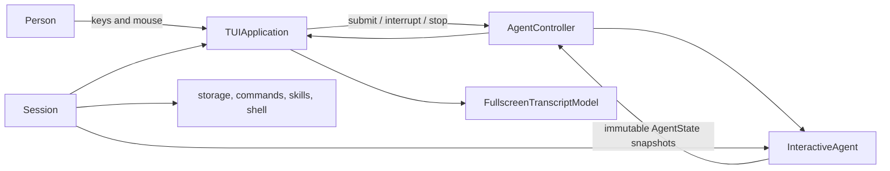

# How the NOOA terminal UI works

This document explains the terminal UI (TUI) from first principles. It is for
contributors who have not worked on a terminal application before.

If you want to **use** the TUI rather than change it, start with the
[practical user guide](tui-user-guide.md).

## The short version

The TUI is the interactive home for a NOOA agent. It has three jobs:

1. turn keyboard and mouse actions into requests for the agent;
2. turn the agent's changing state into a readable conversation; and
3. leave the terminal exactly as it found it, even when something fails.

The default experience is a fullscreen application built with
[prompt_toolkit](https://python-prompt-toolkit.readthedocs.io/). One component,
`TUIApplication`, owns the screen for the lifetime of the application. Agent
work happens outside that renderer. The two sides meet through a small Python
interface called `InteractiveAgent`.



That separation is the central design decision: the renderer presents state,
the agent owns work, and the session composes and cleans up both.

## Why we built it this way

A terminal looks like a grid of characters, but it is really a shared stream of
commands. Printing a line can move the cursor. A resize can change where old
text wraps. Mouse reporting changes what the terminal sends for a click. ANSI
escape sequences can alter color, erase the screen, set the window title, or
even write to the clipboard.

An ordinary command-line program can mostly print and move on. An interactive
agent cannot:

- answers stream while the user is typing;
- tools and background jobs produce output concurrently;
- the transcript must scroll without moving the composer;
- resize must reflow Unicode text correctly;
- selection must copy the text the user saw, not terminal control bytes;
- the user must be able to interrupt, switch agents, or leave at any time; and
- failures must not strand the shell in an alternate screen or raw input mode.

The first and most important rule is therefore:

> While fullscreen mode is running, prompt_toolkit is the only owner of the
> terminal. Everything else updates application state.

No background task prints directly to stdout. No second renderer tries to
repair cursor position. No component asks the terminal where the cursor is.
The application redraws from its model, like a small GUI.

## What the user sees

The fullscreen layout has three durable regions:

```text
┌──────────────── transcript ────────────────┐
│ messages, tool output, progress, errors    │
│                                            │
├──────────────── composer ──────────────────┤
│ ❯ editable multi-line input                │
├──────────────── status / toolbar ──────────┤
│ model, context, session, transient notices │
└────────────────────────────────────────────┘
```

Commands such as `/events` can temporarily replace the transcript with a
**subview**. The outer application still owns input, mouse routing, resize, and
terminal cleanup. Closing the subview reveals the transcript at the same
logical position.

## The pieces and their responsibilities

### `Session`: the composition root

`session.py` builds a running interaction. It knows about project storage,
event history, commands, skills, the shell, and the concrete local agent. It
creates those resources, connects them, and closes what it created.

`Session` is deliberately not the screen renderer. This keeps persistence and
agent lifecycle testable without a terminal and prevents UI code from reaching
through layers to concrete queues or databases.

### `InteractiveAgent`: the boundary around an agent

The renderer does not know how an agent runs. It sees this structural Python
interface from `nooa_cli.interactive`:

```python
class InteractiveAgent(Protocol):
    @property
    def state(self) -> AgentState: ...
    def observe(self, callback, scheduler, on_terminated=None) -> Observation: ...
    def submit(self, text: str) -> bool: ...
    def interrupt(self) -> bool: ...
    def withdraw_pending_input(self) -> str | None: ...
    def stop(self) -> bool: ...
```

The contract uses ordinary Python calls and immutable `AgentState` snapshots.
It is not a network protocol. A future remote agent can provide a proxy that
implements the same interface, but reconnect messages and wire formats belong
inside that proxy rather than in the renderer.

A command returning `True` means the request was accepted. The resulting state
is already observable before the call returns; completion can happen later.

### `LocalAgentRunner`: local execution

`LocalAgentRunner` adapts the in-process coding agent to `InteractiveAgent`. It
owns local dispatch, callbacks, queue interaction, and its worker lifecycle.
Those details stay outside both `TUIApplication` and the public interface.

### `AgentController`: safe observation and switching

`AgentController` is the renderer-facing coordinator. It subscribes to one
agent, holds its latest snapshot, and routes user actions to it.

Its less visible job is handling races. If an agent is replaced, callbacks from
the previous observation may already be queued. The controller labels each
subscription with a generation and ignores late callbacks from old
generations. A replacement is transactional: if observing the new agent fails,
the old one remains active.

If observation itself fails, the controller exposes a disconnected state and
rejects commands. Showing a failure is safer than accepting input against a
frozen screen.

### `TUIApplication`: terminal owner and interaction shell

`tui_application.py` creates the prompt_toolkit `Application`, layout, key
bindings, mouse handlers, composer, toolbar, transcript window, and subview
host. It marshals changes from background threads onto the application's event
loop and requests redraws there.

It does not run the agent. It displays snapshots and calls the narrow
controller API when the user submits, interrupts, or stops.

### `AgentEventRenderer`: meaning into presentation

Agent events have meaning: a message is Markdown, a tool call has a status, a
file edit has a diff. `agent_event_renderer.py` turns those semantic events
into Rich renderables and presentation blocks. `frontend.py` provides the
higher-level presentation operations used by the session and commands.

Keeping this step explicit prevents every producer from inventing its own
terminal behavior.

### `FullscreenTranscriptModel`: text that can be reprojected

A terminal screen stores cells, not a document. The fullscreen transcript must
nevertheless behave like a document when it wraps, scrolls, resizes, and copies.
`fullscreen_transcript.py` supplies that model.

It stores immutable, terminal-safe records with stable IDs. Projection turns
those records into visual rows for the current terminal width. The viewport is
anchored to a logical record and row, not merely an absolute screen offset.
That is why incoming output and resize do not make a scrolled-up view jump.

The live model is intentionally bounded to 10,000 records or a conservative
16 MiB resident-text budget, whichever comes first. This is only the visible
working set; durable event history has separate storage and remains available
through `/events`.

### Explorers and overlays

`event_explorer.py`, `memory_explorer.py`, `session_explorer.py`,
`todo_explorer.py`, `job_explorer.py`, and `activity_overlay.py` implement
focused views. The fullscreen application hosts them as subviews rather than
starting nested terminal applications. The host keeps one input loop and one
terminal owner.

### Terminal safety

`terminal_safety.py` treats output from models, tools, subprocesses, logs, and
exceptions as untrusted. Fullscreen mode accepts a small safe subset of ANSI
styling and hyperlink metadata. Cursor movement, erase commands, title and
clipboard operations, device-control strings, and malformed escapes are never
sent back to the terminal as commands.

This is both a security boundary and a correctness boundary: arbitrary control
sequences would invalidate prompt_toolkit's idea of the screen.

## How one turn travels through the system

1. The user edits text in the composer and presses Enter.
2. `TUIApplication` asks `AgentController.submit()` to route the text.
3. The controller calls the active `InteractiveAgent`.
4. The local runner admits the input and publishes a new immutable state.
5. The observation schedules delivery on the prompt_toolkit owner loop.
6. The UI compares the snapshot with what it has presented.
7. Semantic events are rendered and appended or updated in the transcript.
8. The application invalidates the screen; prompt_toolkit paints the next frame.
9. Streaming updates repeat steps 4–8 without blocking composer editing.

An observation keeps only its latest pending state and serializes callbacks.
Fast publishers therefore coalesce instead of creating an unbounded redraw
backlog, while an older state can never overwrite a newer one.

## Scrolling, selection, and resize

At the bottom of the transcript, the viewport follows new output. As soon as
the user scrolls upward, it records a logical anchor. New output continues to
arrive, but the visible rows stay put. A “Return to bottom” affordance resumes
following the tail.

Fullscreen drag selection maps screen cells back to logical text offsets. Copy
therefore excludes soft wraps and ANSI styling and preserves Unicode grapheme
clusters. Selection remains valid when unrelated old records are evicted.
Modified drag or `F6` releases mouse ownership so the terminal or tmux can make
its own native selection.

On resize, ordinary records are projected at the new cell width; they are not
re-emitted as terminal bytes. Width-sensitive Rich content has a semantic
rerender callback that is cached and coalesced until resizing settles. This
keeps normal resize proportional to visible projection rather than invoking
thousands of render callbacks.

Terminal width is measured in cells, not Python characters. CJK characters,
emoji, combining marks, and other grapheme clusters remain atomic. In the
pathological case where a valid grapheme is wider than a one-cell viewport, the
model keeps the original text and shows a narrow ellipsis only in the screen
projection.

## Startup and shutdown

Terminal applications are judged as much by how they leave as by how they run.
The session therefore treats cleanup as independent phases. It closes
observations, background producers, the renderer, local agent resources, and
terminal state even when an earlier phase raises. The original application
failure remains the primary exception; cleanup failures do not hide it.

Tests exercise the complete local composition path and use a real POSIX pseudo
terminal to verify alternate-screen entry and restoration on normal exit.
Fault-injection tests verify cleanup order and exception precedence.

## Design rules for contributors

When adding a feature, preserve these rules:

1. **One terminal owner.** In fullscreen mode, update application state; do not
   print, call `run_in_terminal`, clear scrollback, or issue cursor controls.
2. **Meaning before pixels.** Preserve semantic source until presentation. Do
   not reverse-engineer Markdown, code, or links from rendered ANSI text.
3. **Immutable observations.** Publish complete `AgentState` values. Do not let
   renderer code inspect a concrete agent's queues or locks.
4. **The owner loop mutates the UI.** Background work schedules changes; it
   does not edit prompt_toolkit state directly.
5. **Logical anchors survive geometry.** Selection and scrolling refer to
   record IDs and source offsets rather than transient screen rows.
6. **Input and output are untrusted.** Validate clipboard text and sanitize all
   terminal sequences at the boundary.
7. **Resource ownership is explicit.** The component that creates a resource
   closes it exactly once. Observation lifetime is not agent lifetime.
8. **Failure stays visible and recoverable.** Reject actions rather than
   pretending a disconnected or stopped agent accepted them.
9. **Test behavior at the right layer.** Use model tests for projection,
   component tests for screen cells, race tests for lifecycle, and PTYs for
   terminal restoration.

## Where to start in the code

| If you want to change… | Start with… |
| --- | --- |
| layout, keys, mouse, composer, status | `tui_application.py` |
| transcript wrapping, anchors, selection | `fullscreen_transcript.py` |
| rendering of agent messages and tools | `agent_event_renderer.py` and `frontend.py` |
| commands and completion | `commands.py`, `command_runner.py`, `completer.py` |
| events, memories, sessions, jobs, todos | the corresponding `*_explorer.py` |
| local agent execution | `interactive/local_agent.py` and `tui/agent.py` |
| state observation and switching | `interactive/state.py` and `agent_controller.py` |
| terminal escape handling | `terminal_safety.py` |
| composition, persistence, teardown | `session.py` |
| colors and status items | `theme.py` and `toolbar.py` |

Tests under `packages/nooa-cli/tests/tui/` mirror these boundaries. The direct
agent contract is covered in `packages/nooa-cli/tests/test_interactive_agent.py`
and `test_local_agent_runtime.py`.

## Future work

The architecture is intentionally ready for several improvements without
changing terminal ownership:

- **A unified explorer system.** Events, memories, sessions, jobs, todos, and
  activity should share layout primitives, navigation, mouse interaction,
  selection, copy feedback, empty states, and responsive behavior.
- **Semantic code-block actions.** Markdown rendering should retain source maps
  for fenced blocks so a visible Copy action can copy exact code—not borders,
  line numbers, styling, or soft wraps. The same provenance enables “Copy as
  Markdown” for semantic selections.
- **More terminal lifecycle diagnostics.** Opt-in traces around application
  entry/exit, intentional handoffs, teardown phases, and signal-triggered
  asyncio task dumps will make rare terminal ownership failures diagnosable.
- **Broader PTY and soak coverage.** EOF, interrupt, startup failure, repeated
  resize, tmux, and SSH scenarios should become automated where practical.
- **Remote agents behind the same interface.** A transport proxy may implement
  `InteractiveAgent`; transport state must remain private to that adapter.
- **Accessibility and discoverability.** A built-in shortcut overlay, clearer
  focus cues, and keyboard equivalents for every mouse action should accompany
  visual polish.

These are extensions of the current model, not reasons to introduce another
screen writer or couple the renderer to agent internals.
